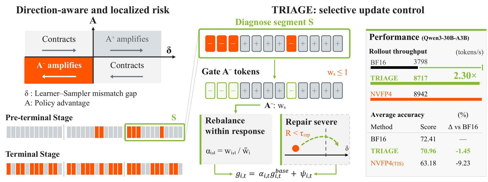
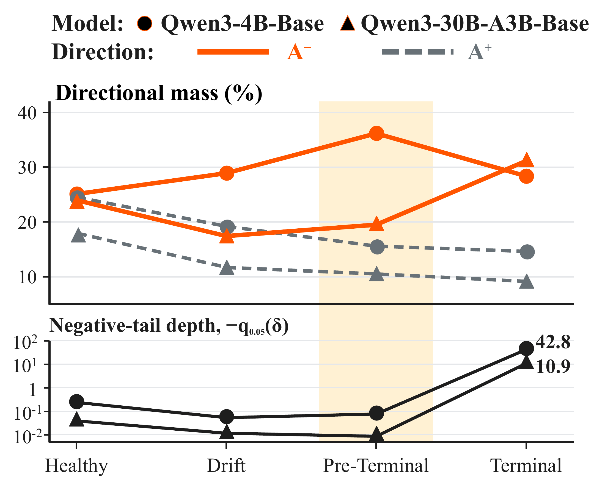
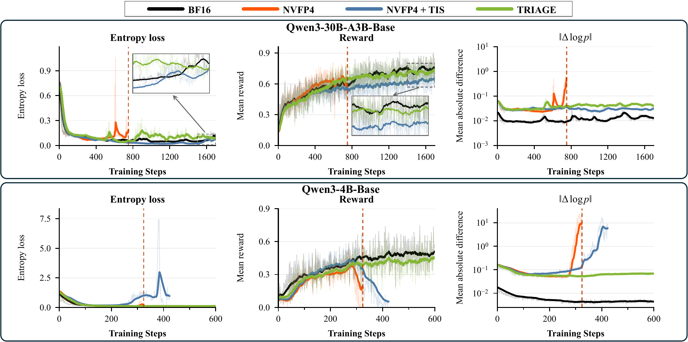
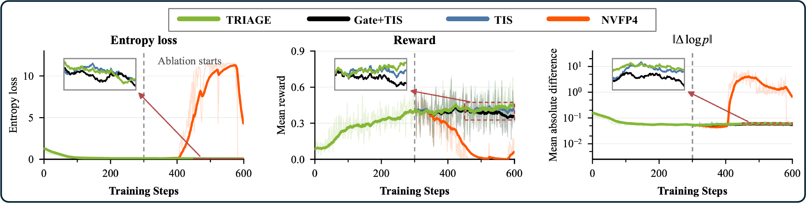

<p align="center">
  
</p>

# TRIAGE: Direction-Aware Mismatch Stabilization of Native NVFP4 Reinforcement Learning

**A Slime policy-loss extension for stable native NVFP4 RL training.**

[](LICENSE)
[](https://github.com/InfiXAI/TRIAGE/actions/workflows/ci.yml)
[](pyproject.toml)

[中文](README_zh.md) · [Docs](docs/TRAINING.md) · [Benchmarks](benchmarks/README.md) · [Characterization](docs/CHARACTERIZATION.md)

> **TL;DR:** TRIAGE uses a direction-aware **Gate** and a bounded **Repair** to control learner–sampler mismatch, keeping native NVFP4 reinforcement learning stable while retaining W4A4 forward execution end to end.

## Highlights

- **Stability** — With TRIAGE, native NVFP4 RL stays stable for 600 steps (Qwen3-4B) and 1,700 steps (Qwen3-30B-A3B), where naive NVFP4 destabilizes at ~300 steps (4B) / ~700 steps (30B-A3B); adding truncated importance sampling (TIS) alone still collapses on 4B and survives on 30B-A3B only at a 9-point accuracy cost.
- **Efficiency** — NVFP4 execution gives 2.08–2.35× rollout throughput and 1.21–1.33× end-to-end iteration speedup over BF16 on 8×B300; TRIAGE retains 2.27–2.30× rollout while adding only 0.84% median learner-update overhead.
- **Accuracy** — Matches BF16-level benchmark averages: 58.51 vs. 58.31 on 4B (above BF16) and 70.96 vs. 72.41 on 30B-A3B (−1.45), while NVFP4+TIS drops to 50.77 (4B, collapsed checkpoint) / 63.18 (30B-A3B).



*TRIAGE diagnoses learner–sampler mismatch in short response segments, gates updates whose direction amplifies the gap, and repairs residual negative mismatch — stability without leaving the native W4A4 execution path.*

## News

- **[2026/09] v1.0.0** — Initial public release of TRIAGE: the policy-loss extension, example launchers, benchmark results, and the mismatch-characterization study.

## Why TRIAGE

Mismatch magnitude alone does not reveal whether the next policy update will correct or amplify a learner–sampler probability gap: even while training is already drifting, the large majority of tokens keep tiny gaps. The *direction* of the mismatch is the earlier signal — advantage-weighted token mass shifts toward the negative, amplifying side long before the marginal gap distribution looks severe. TRIAGE acts on that signal: it diagnoses risk in short segments, selectively gates amplifying updates, and repairs residual negative mismatch, operating alongside PPO/TIS on dense and MoE models.



*The directional-asymmetry ratio ρ_asym climbs from 1.02 to 2.32 on 4B and from 1.34 to 1.85 on 30B-A3B by the pre-terminal window, while at least 83.0% / 91.9% of tokens still sit in the small-magnitude band |δ| < 0.05 — direction degrades long before magnitude does. Full study: [docs/CHARACTERIZATION.md](docs/CHARACTERIZATION.md).*

## Installation

TRIAGE has two install tiers.

**(a) Loss package and CPU tests** — any machine with Python 3.10+, PyTorch, and NumPy:

```bash
python -m pip install -e .
bash scripts/run_tests.sh
```

**(b) Full training stack** — requires Slime, SGLang, Megatron-LM, and miniTransformer at the pinned commits, plus Blackwell-class GPUs for NVFP4 execution. miniTransformer is an internal release without a public URL, required only for the MoE (Qwen3-30B-A3B) NVFP4 execution path; the dense 4B path does not need it. See [docs/ENVIRONMENT.md](docs/ENVIRONMENT.md) for environment setup and [docs/STACK_AND_CHANGES.md](docs/STACK_AND_CHANGES.md) for the pinned revisions and patch contents.

## Quick Start

### Enable TRIAGE on an existing Slime launch

```bash
# 1. Apply the source-level patch that exposes the TRIAGE loss hooks
#    (idempotent and hash-gated; point SLIME_ROOT at your Slime tree).
export SLIME_ROOT=/path/to/slime
bash scripts/apply_patches.sh tokenmean

# 2. Make the extension importable.
export PYTHONPATH="$PWD/policy_extension:${PYTHONPATH:-}"

# 3. Enable Gate and Repair with the reference direction-aware scopes.
export TRIAGE_GATE_ENABLE=1 TRIAGE_REPAIR_ENABLE=1
export TRIAGE_GATE_SCOPE=q3 TRIAGE_REPAIR_SCOPE=adv_positive TRIAGE_RECENTER_ENABLE=0

# 4. Add the TRIAGE loss to your existing Slime launch arguments.
#    --calculate-per-token-loss is required: triage_custom_loss raises
#    without it. The reported TRIAGE configuration runs together with
#    TIS, so --use-tis and its clip bounds are included here.
python3 "$SLIME_ROOT/train.py" ... \
  --calculate-per-token-loss \
  --use-tis --tis-clip 2.0 --tis-clip-low 0.0 \
  --loss-type custom_loss \
  --custom-loss-function-path TRIAGE.triage_custom_loss \
  --rollout-data-postprocess-path TRIAGE.triage_rollout_postprocess
```

On remote Ray actors the `TRIAGE_*` variables must reach the training actors
through Slime's `--train-env-vars`; the example launchers below serialize and
forward them automatically via `scripts/train_env.py` (see
[docs/TRAINING.md](docs/TRAINING.md)).

### End-to-end example scripts

Inspect the full resolved command without a GPU or the training stack:

```bash
DRY_RUN=1 bash examples/train_triage.sh
```

Set the paths once, then choose a training mode:

```bash
export SLIME_ROOT=/path/to/slime
export SGLANG_ROOT=/path/to/sglang
export MEGATRON_ROOT=/path/to/Megatron-LM
export MODEL_ROOT=/path/to/models
export PROMPT_DATA=/path/to/dapo-math-17k.jsonl

bash examples/train_bf16.sh      # 208.2 s/iter, 2,977 tokens/s rollout
bash examples/train_nvfp4.sh     # 169.4 s/iter, 6,201 tokens/s rollout
bash examples/train_triage.sh    # 172.1 s/iter, 6,745 tokens/s rollout
```

Wall-clock figures (measured with `MODEL=qwen3-30B-A3B R3=0`; the scripts
default to Qwen3-4B): Qwen3-30B-A3B-Base, one node with 8×B300, global batch
256, natural EOS up to 20,480 tokens, mean of ten iterations after two warm-ups,
R3 capture off. The default scripts save checkpoints and are not the timing
recipe; the benchmark protocol lives in
[benchmarks/README.md](benchmarks/README.md). The three scripts share
[`common.sh`](examples/common.sh); defaults are Qwen3-4B-Base, one node × eight
GPUs, batch 256, and a 16,384-token response limit. Use `MODEL=qwen3-30B-A3B`
for MoE; `USE_TIS=1` with `examples/train_nvfp4.sh` gives the NVFP4+TIS baseline
(it is already the default for `train_triage.sh`); and `START_LOCAL_RAY=1`
starts a local Ray head. See [docs/TRAINING.md](docs/TRAINING.md) for
checkpoints, resume, evaluation, and runtime setup.

### Gate and Repair configuration

Algorithm defaults live in [`triage_config.py`](policy_extension/triage_config.py);
the launchers carry only activation switches, and no tuning values are duplicated
in shell.

| Control | Setting | Default / choices |
|---|---|---|
| Gate scope | `TRIAGE_GATE_SCOPE` | `whole`; choose `q3` for negative-gap tokens |
| Repair scope | `TRIAGE_REPAIR_SCOPE` | `whole`, `adv_positive`, `q2`; default `whole` |
| Repair strength | `TRIAGE_REPAIR_COEF` | `0.015` |
| Repair start | `TRIAGE_REPAIR_START_STEP` | `0`, inclusive |

Optional Gate calibration is off by default:

```bash
python scripts/calibrate_gate.py --input /path/to/reference_jsonl \
  --output /shared/calibration/gate.json
TRIAGE_CALIBRATION_PATH=/shared/calibration/gate.json bash examples/train_triage.sh
```

See [docs/CALIBRATION.md](docs/CALIBRATION.md) for reference-window collection
and frozen-threshold use.

## Results



*Naive NVFP4 collapses on both models (~700 steps on 30B-A3B, ~300 on 4B); NVFP4+TIS delays the failure but still collapses on 4B and survives on 30B-A3B only by trading away accuracy; TRIAGE keeps entropy, reward, and the learner–sampler gap stable for the full 1,700 / 600 steps on both.*



*Each removed component degrades stability further: branching from the step-300 TRIAGE checkpoint, removing all three components (naive NVFP4) collapses within the window, while Gate+TIS and TIS survive but sit progressively below full TRIAGE.*

Throughput and full benchmark tables: [benchmarks/README.md](benchmarks/README.md).

## Documentation

| Document | Contents |
|---|---|
| [docs/TRAINING.md](docs/TRAINING.md) | Launch modes, checkpoints, resume, evaluation, runtime setup |
| [docs/ENVIRONMENT.md](docs/ENVIRONMENT.md) | Environment setup for the full training stack |
| [docs/METHODS.md](docs/METHODS.md) | Gate and Repair mechanics as implemented |
| [docs/CHARACTERIZATION.md](docs/CHARACTERIZATION.md) | The mismatch characterization study behind the design |
| [docs/CALIBRATION.md](docs/CALIBRATION.md) | Optional Gate reference-window calibration |
| [docs/STACK_AND_CHANGES.md](docs/STACK_AND_CHANGES.md) | Pinned stack revisions and patch contents |
| [docs/PAPER_AND_CODE.md](docs/PAPER_AND_CODE.md) | Correspondence between the paper and this codebase |
| [docs/VALIDATION.md](docs/VALIDATION.md) | Checks performed and remaining hardware validation |
| [benchmarks/README.md](benchmarks/README.md) | Measurement protocols and full result tables |

## Roadmap & known limitations

Planned, in rough priority order:

- Per-ablation numeric summaries and a standalone final-checkpoint evaluation runner.
- Per-response weighted-mean normalization alignment (this branch currently uses global weighted-token normalization; see [docs/PAPER_AND_CODE.md](docs/PAPER_AND_CODE.md)).
- Upstreaming the Slime/SGLang compatibility patches.
- Reference checkpoints for the reported runs.

Known limitation: NVFP4 execution requires Blackwell-class GPUs (the throughput
numbers above were measured on one node with 8×B300). BF16 training runs on
earlier NVIDIA hardware, and the loss package with its CPU tests runs anywhere.

## FAQ

**What hardware do I need?** The loss package, CPU tests, and `DRY_RUN=1` launcher inspection run on any machine. NVFP4 training requires Blackwell-class GPUs; BF16 training works on earlier NVIDIA GPUs.

**How do I check my setup before launching?** Run `python scripts/preflight.py --mode triage --model qwen3-30B-A3B --r3 1` (the launchers also run it automatically). It verifies stack revisions, patch state, and overlay hashes before any GPU work starts.

**Are the patches safe to re-apply?** Yes. They are idempotent and hash-gated: preflight distinguishes stock from patched sources, and re-applying a patch to an already-patched tree is a no-op.

**How do I recalibrate the Gate thresholds?** Follow [docs/CALIBRATION.md](docs/CALIBRATION.md): export a reference window with `scripts/calibrate_gate.py`, then point `TRIAGE_CALIBRATION_PATH` at the frozen thresholds.

**Which models are supported?** The launchers ship configurations for Qwen3-4B-Base (dense) and Qwen3-30B-A3B-Base (MoE); the loss itself is model-agnostic. The MoE NVFP4 execution path additionally requires miniTransformer, an internal release without a public URL; the dense 4B path does not.

## Citation

```bibtex
@misc{triage2026,
  title  = {TRIAGE: Direction-Aware Mismatch Stabilization of Native NVFP4 Reinforcement Learning},
  author = {TRIAGE Contributors},
  year   = {2026},
  url    = {https://github.com/InfiXAI/TRIAGE},
}
```

The paper BibTeX entry will be added here on publication.

## Acknowledgements

TRIAGE builds on [Slime](https://github.com/THUDM/slime) as the RL framework,
[SGLang](https://github.com/sgl-project/sglang) for rollout and serving,
[Megatron-LM](https://github.com/NVIDIA/Megatron-LM) as the training backend, and
[Transformer Engine](https://github.com/NVIDIA/TransformerEngine) for NVFP4
execution. We thank the authors and contributors of these projects.

## License

Apache-2.0. See [LICENSE](LICENSE); the scope of redistributed code is documented in [NOTICE](NOTICE.md).
