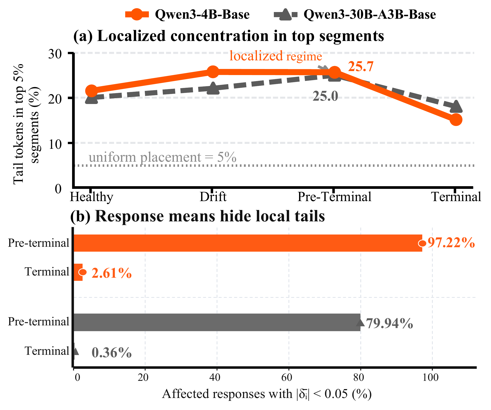
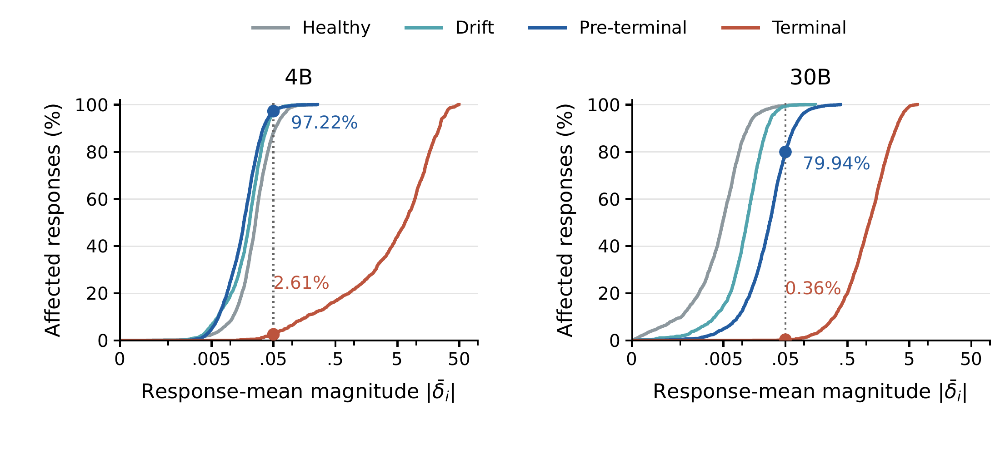
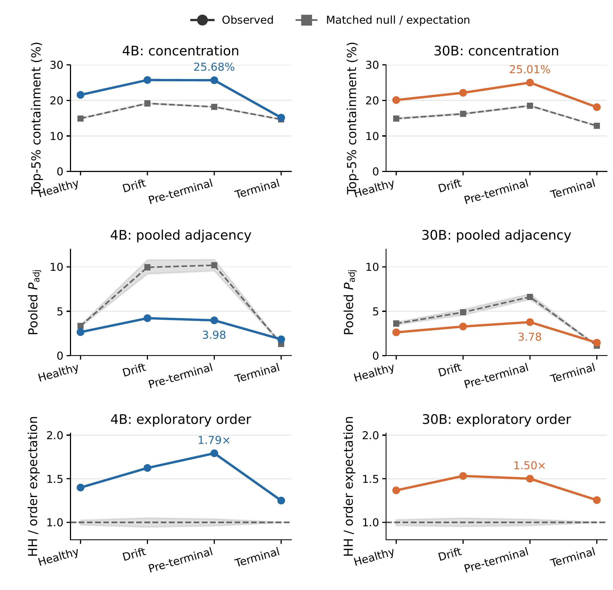
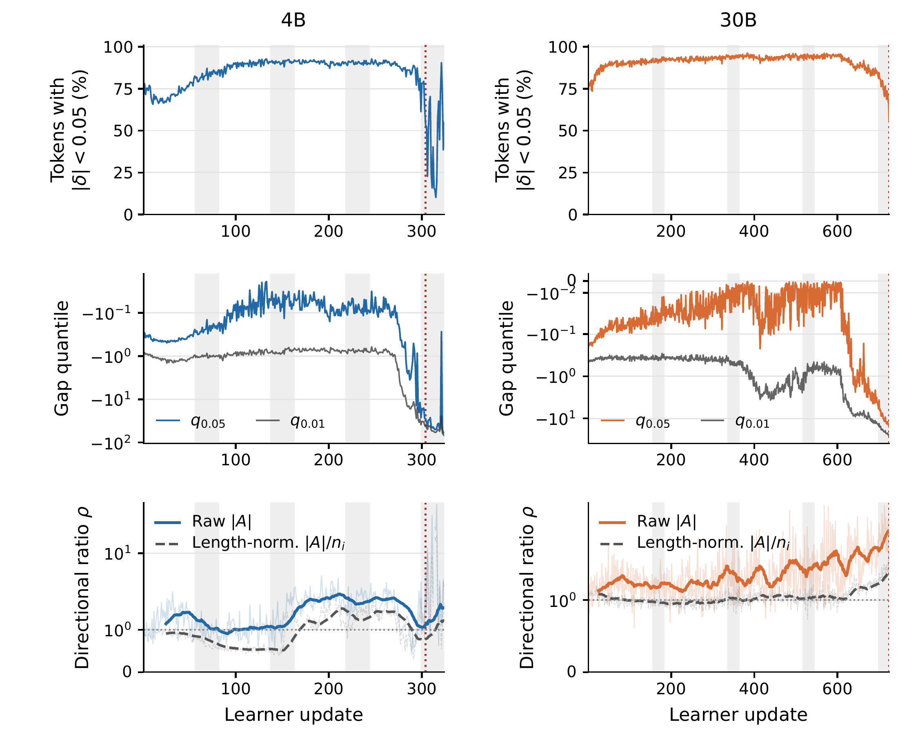

# Characterizing learner–sampler mismatch in native NVFP4 RL

This page documents the mismatch-measurement study behind TRIAGE: which
learner–sampler probability gaps policy optimization amplifies, when the
imbalance becomes visible, and where it accumulates inside long responses.
All values below were measured on the two characterization runs described
next. The shipped aggregates in
[benchmarks/results/characterization/](../benchmarks/results/characterization/)
back the stage-table metrics (r_amp, C_tok, P_adj, and the ρ ratios), the
signed-mean dilution fractions, and the window-width and weighting
sensitivity checks. All other values on this page — H_seg coverage, tail
quantiles, bulk fractions, calibration thresholds, token totals, the
randomization controls, and the sign-agreement audit — are computed from the
full per-token trajectory dumps, which are too large to ship with this
repository.

## Characterization runs and analysis windows

Both runs are native-NVFP4 GRPO trainings on DAPO-Math-17K (17,398 prompts)
with learner seed 1234 and rollout/data seed 42. Each rollout samples 16
prompts with 16 responses per prompt (global batch 256), followed by one
optimizer update; sampler weights are refreshed after every learner update.
Rollouts use temperature 1.0, top-p 1.0, top-k −1, and a maximum completion
length of 16,384 tokens (4B) or 20,480 tokens (30B). Optimization uses Adam
with a constant learning rate of 10⁻⁶ and no warm-up, β₁=0.9, β₂=0.98,
ε=10⁻⁸, weight decay 0.1, and gradient clipping at 1.0. Master parameters,
accumulated gradients, and optimizer states are FP32; the sampler KV cache is
BF16.

NVFP4 runs in native W4A4 with one-dimensional block scaling, no 16×16 square
weight scaling, randomized Hadamard transforms enabled, and stochastic
rounding for gradient quantization. On Qwen3-4B-Base, NVFP4 covers the gate,
up, and down projections of every MLP layer, with attention, normalization,
and the tied embedding/output weights in BF16. On Qwen3-30B-A3B-Base, all
expert MLP layers are quantized, with attention, normalization, embeddings,
routing gates, and the independent LM head in BF16, and routing replay
enabled. Hardware is NVIDIA B300 GPUs; the training stack is PyTorch 2.9.1
with CUDA 13.0, Transformer Engine 2.10.0, miniTransformer 1.0.0, and
SGLang 0.5.10 (see [compatibility.json](../compatibility.json) for the pinned
Slime/Megatron revisions).

**Two estimands.** The per-token gap is
δ = (learner log-prob) − (frozen generation-time sampler log-prob). The 4B
run measures this vanilla learner–sampler gap directly. The 30B run evaluates
learner-side teacher-forced log-probabilities while replaying the sampler's
MoE routing decisions, so its measured gap is a *residual* mismatch after
conditioning on routing. Absolute mismatch magnitudes from the two runs are
therefore not directly comparable; the models are used jointly only for
population-level directional and localization patterns.

Across successful updates, the logged trajectories contain 232,089,183 valid
completion tokens (4B) and 230,713,088 (30B). Zero-advantage responses account
for 41.27% and 33.16% of these tokens. Marginal gap statistics use all valid
completion tokens; gradient-bearing occupancy excludes A=0, and |A|-weighted
statistics automatically assign zero mass to such tokens.

**Stage windows.** For each model we place analysis anchors at 25%, 50%, 75%,
and 100% of the characterization horizon and use the inclusive 25-update
trailing window ending at each anchor. Stage names are descriptive shorthand
for these progress-normalized anchors, not independently selected phases.

| Model (horizon) | Healthy | Drift | Pre-terminal | Terminal |
|---|---|---|---|---|
| Qwen3-4B-Base (324 updates) | 57–81 | 138–162 | 219–243 | 300–324 |
| Qwen3-30B-A3B-Base (724 updates) | 157–181 | 338–362 | 519–543 | 700–724 |

The collapse trigger is run-specific. For 4B, an update is flagged when
raw_reward ≤ 0.10 and pass@16 ≤ 0.3125 (the latter over the rollout group of
16 samples per prompt); the collapse onset is the first update completing
three consecutive violations, update 304. For 30B, the onset is the first
update with a non-finite logged gradient norm, update 724, which terminates
the trajectory. For the 30B terminal window, update 724 contributes its
pre-update snapshot to distributional and segment statistics, but the failed
optimizer step is not included in successful-update token counts. For 4B, the
terminal window extends beyond the first collapse trigger and characterizes
the resulting global-mismatch regime.

## Directional asymmetry precedes negative-tail explosion

The policy-gradient update on a token locally amplifies an existing gap when
δ and the signed update coefficient have the same sign, and contracts it
otherwise. For vanilla GRPO this reduces to the sign interaction A·δ, giving
two amplifying regions: A⁻ = {A<0, δ<0} and A⁺ = {A>0, δ>0}. To measure how
update mass is distributed between them, define the advantage-weighted token
mass w_A(R) of a region and the directional ratio ρ_asym = w_A(A⁻)/w_A(A⁺).

*Top: share of total raw |A| weight falling in each amplifying region, per
stage window. Bottom: 5% gap quantile per stage. The shaded band marks the
pre-terminal window.*

From the healthy window to the pre-terminal window the marginal gap
distribution still looks benign — the fraction of tokens with |δ|<0.05 stays
at or above 83.0% (4B) and 91.9% (30B) — yet ρ_asym rises from **1.02 to
2.32** on 4B and from **1.34 to 1.85** on 30B. The two theoretically symmetric amplifying regions
become empirically imbalanced well before a broad magnitude increase is
visible. In the terminal stage the lower tail then expands abruptly: within
each run's estimand, q₀.₀₅(δ) reaches **−42.75** on 4B and **−10.94** on 30B.
Directional asymmetry therefore identifies an earlier warning interval, while
the negative-tail explosion characterizes the terminal regime.

## Segment-level localization (W=64)

Each response is partitioned independently by zero-based completion-token
position into non-overlapping segments of W=64 tokens; masked positions are
excluded without reindexing, and the final short segment is retained. Segment
statistics are computed over responses with A<0, since the localized failure
mode of interest is the negative-gap amplifying region. A token is an
*amplifying-tail token* when A<0 and δ < τ_ana, where the threshold is
calibrated once per model as the 5% quantile of δ over **all** valid response
tokens in the healthy window: τ_ana = −0.24208 (4B) and −0.03949 (30B).
Fixing the threshold before drift keeps the localization question separate
from later global tail growth. A segment is *tail-heavy* when more than 10%
of its valid tokens are amplifying-tail tokens.

Stage-wise statistics (r_amp = global amplifying-tail base rate, H_seg =
tail-heavy segment coverage, C_tok = share of amplifying-tail tokens inside
the top-5% segments ranked by tail fraction, P_adj = adjacent tail-heavy
persistence relative to the successor-heavy marginal):

| Model | Stage | r_amp (%) | H_seg (%) | C_tok (%) | P_adj |
|---|---|---:|---:|---:|---:|
| 4B | Healthy | 4.90 | 15.08 | 21.56 | 2.65 |
| 4B | Drift | 2.60 | 5.43 | 25.74 | 4.22 |
| 4B | Pre-terminal | 2.75 | 6.24 | 25.68 | 3.98 |
| 4B | Terminal | 31.53 | 48.64 | 15.13 | 1.84 |
| 30B | Healthy | 4.79 | 14.46 | 20.10 | 2.62 |
| 30B | Drift | 3.82 | 10.43 | 22.15 | 3.28 |
| 30B | Pre-terminal | 3.59 | 10.25 | 25.01 | 3.78 |
| 30B | Terminal | 22.91 | 57.02 | 18.09 | 1.45 |

*(a) Share of amplifying-tail tokens contained in the top 5% of segments,
against the 5% uniform-placement reference. (b) Fraction of affected
responses whose signed mean gap stays below 0.05.*

From healthy to pre-terminal, the tail's global frequency *decreases* (4.90%
→ 2.75% on 4B, 4.79% → 3.59% on 30B) while C_tok *increases* to 25.68% and
25.01%: the top 5% of segments hold about a quarter of all amplifying-tail
tokens, roughly **5×** the uniform-placement mass, and adjacent tail-heavy
persistence rises from about **2.6×** to **3.8–4.0×** the pooled marginal
rate. The precursor is not an expanding global tail but a reorganization of a
small tail population into a few persistent local regions. At the terminal
stage, coverage broadens instead: tail-heavy segments reach 48.64% (4B) and
57.02% (30B) of all eligible segments, and top-segment containment declines.

## Response means dilute local tails

*Empirical CDFs of |δ̄ᵢ| among A<0 responses containing at least one
tail-heavy W=64 segment, per stage window; the dotted line marks 0.05.*

Response-level averages hide the localized tails. At pre-terminal, **97.22%**
of affected 4B responses and **79.94%** of affected 30B responses still
satisfy |δ̄ᵢ| < 0.05, where δ̄ᵢ is the signed mean gap over valid tokens of
the response. At the terminal stage those fractions collapse to **2.61%** and
**0.36%**. Replacing the signed mean with the mean absolute token gap gives
pre-terminal fractions of 52.37% and 50.21% at the same cutoff — signed
cancellation contributes to the dilution, but a local tail can also coexist
with a small mean absolute gap.

## Randomization controls

Concentration metrics can be inflated by response-level tail-rate
heterogeneity and by top-segment selection itself, so we randomize tail
positions within each response. The control fixes valid-token positions,
response length, and the total tail-token count of every A<0 response, then
uniformly permutes binary tail labels (implemented exactly as multivariate
hypergeometric allocation, preserving segment capacities including short
segments). Each of **499** randomization draws (seed 20260924) recomputes
segment tail fractions, the global top-5% ranking, and P_adj; we report
central 95% conditional randomization intervals. These intervals describe
random placement within the observed responses, not variability across
independent training runs.

*Top: observed C_tok versus the token-shuffle null. Middle: observed pooled
P_adj versus the same null. Bottom: an exploratory segment-order test
conditioned on each response's heavy-segment count.*

At pre-terminal, observed C_tok is **25.68%** (4B) and **25.01%** (30B),
against null medians of **18.17%** and **18.50%** with intervals
[18.11%, 18.23%] and [18.38%, 18.63%] — excesses of 7.51 and 6.51 percentage
points beyond response-level heterogeneity and rank selection. Excess
concentration is also present in the healthy windows; its magnitude does not
increase monotonically across both trajectories.

**The adjacency result does not survive this control, and we say so
plainly.** Observed pre-terminal P_adj is 3.98 on 4B and 3.78 on 30B, but the
token-shuffle null medians are *higher* — 10.18 and 6.62 respectively — so
the elevation of P_adj above one does not establish persistence beyond the
response-conditioned null. Tail-label shuffling changes which segments are
heavy as well as their arrangement.

A separate exploratory test isolates segment order: conditioning on each
response's observed heavy-segment count, we uniformly place the heavy labels
on its full segments and count heavy–heavy adjacent pairs. At pre-terminal,
observed counts are 2,892 versus a random-order expectation of 1,613.85 on
4B (1.79× enrichment) and 1,584 versus 1,055.58 on 30B (1.50×). This
identifies non-random ordering conditional on the observed heavy-segment
counts; it is a different statistic from P_adj and neither excludes
within-response position trends nor establishes causal propagation along the
response.

## Sensitivity: window width, weighting, segment length

**Window width.** Extending the pre-terminal window from 25 to 50 trailing
updates (4B: 219–243 vs 194–243; 30B: 519–543 vs 494–543) moves the
raw-weighted ratio from **2.319 to 2.454** on 4B and from **1.851 to 1.735**
on 30B. Both windows retain the raw-weighted pre-terminal imbalance.

**Weighting.** The primary summary weights tokens by raw |A|. The alternative
q = |A|/nᵢ folds in the response-length reduction factor:

| Model | Stage | ρ (raw \|A\|) | ρ (length-normalized) |
|---|---|---:|---:|
| 4B | Healthy | 1.023 | 0.654 |
| 4B | Drift | 1.504 | 0.796 |
| 4B | Pre-terminal | 2.319 | 1.434 |
| 4B | Terminal | 1.936 | 1.297 |
| 30B | Healthy | 1.337 | 0.963 |
| 30B | Drift | 1.488 | 1.019 |
| 30B | Pre-terminal | 1.851 | 1.049 |
| 30B | Terminal | 3.391 | 1.652 |

Length normalization reduces the pre-terminal ratio to **1.434** (4B) and
**1.049** (30B) and flips whether the ratio exceeds one in some earlier
stages. Raw advantage-weighted token mass and length-normalized coefficient
mass answer different questions; we report both rather than choosing
silently. Note also that A⁻ and A⁺ are both amplifying regions under the
diagonal sign criterion, so their ratio describes directional allocation
within the amplifying part of the decomposition, not the balance between all
amplifying and contracting contributions.

**Segment length.** Repeating the localization analysis with W=128 (same
thresholds, final short segment retained) preserves the qualitative pattern:
r_amp moves 4.90% → 2.75% (4B) and 4.79% → 3.59% (30B) from healthy to
pre-terminal, C_tok moves 18.39% → 21.81% and 17.23% → 21.76%, P_adj moves
2.82 → 5.57 and 2.85 → 4.37, and terminal H_seg reaches 48.98% and 60.25%.
The dilution result is likewise preserved: 96.11% (4B) and 75.99% (30B) of
affected responses stay below |δ̄ᵢ| < 0.05 at pre-terminal, falling to 1.86%
and 0.23% at terminal. The randomization controls above use the default W=64
partition.

**Severe-gap criterion.** The fixed δ < −6 criterion provides a complementary
severity check but is sparse before failure: it marks only 11, 7, and 49
tail-heavy segments in the healthy, drift, and pre-terminal 4B windows, and
0, 4, and 20 on 30B, which makes early adjacency ratios unstable. At the
terminal stage it covers 24.88% (4B) and 10.07% (30B) of eligible tokens. We
therefore keep the healthy-calibrated threshold for localization and use
δ < −6 only to describe the extreme terminal tail.

## Scope of the directional sign indicator

The directional decomposition retains cross-token interactions and optimizer
residuals, so we measured directly when the diagonal sign indicator
sign(δ·g) agrees with the realized one-update motion sign(δ·Δδ). The audit
reuses the identical rollout batch, prefixes, advantages, masks, and logged
sampler log-probabilities, and performs teacher-forced learner replay before
and after one successful optimizer update (late anchors: updates 248–252 for
4B, 598–602 for 30B; eval mode, dropout off, MoE routing cache reused; the
fixed-sampler identity Δδ = z⁺ − z⁻ is checked numerically at 2×10⁻⁶
absolute tolerance). The kernel-level stochastic-rounding RNG state is not
snapshotted, so the audit measures realized implementation-level motion; the
reference sampler stays fixed, so it does not measure the change after
sampler weight refresh.

Agreement (%) on late-stage A⁻ tokens; "Weighted" uses |δ·g| as the token
weight, "Capped" caps it at the population-specific 99.9th percentile († =
low-support stratum):

| Model | Stratum | Tokens | Unweighted | Weighted | Capped |
|---|---|---:|---:|---:|---:|
| 4B | All | 1,640,752 | 38.88 | 47.73 | 46.81 |
| 4B | \|δ\|>0.5 | 47,436 | 47.99 | 50.09 | 49.70 |
| 4B | \|δ\|>1 | 18,822 | 50.43 | 52.34 | 51.99 |
| 4B | \|δ\|>3 | 1,419 | 59.62 | 63.05 | 63.01 |
| 4B | \|δ\|>6 | 392† | 60.20 | 65.75 | 65.73 |
| 30B | All | 231,854 | 33.69 | 25.27 | 25.44 |
| 30B | \|δ\|>0.5 | 9,228 | 25.88 | 24.07 | 24.07 |
| 30B | \|δ\|>1 | 5,887 | 24.27 | 23.27 | 23.35 |
| 30B | \|δ\|>3 | 2,026 | 21.08 | 21.86 | 21.95 |
| 30B | \|δ\|>6 | 723† | 19.78 | 22.18 | 22.20 |

On 4B the indicator becomes substantially more informative as mismatch
severity increases: weighted agreement rises from 47.73% over all eligible
late-stage A⁻ tokens to 63.05% at |δ|>3 (a stratum still spanning 1,419
tokens across 316 responses), stays above 50% at each of the five anchors
(59.03%–66.49%), and capping the largest 0.1% of weights moves the pooled
result only from 63.05% to 63.01%. On 30B the trend does **not** reproduce:
weighted agreement stays below 50% and decreases with severity. In this
routing-conditioned residual setting the diagonal term alone is not a
reliable token-wise predictor, and the current measurements do not isolate
whether cross-token coupling, residual structure, or their interaction causes
this. Token-wise predictiveness claims are therefore restricted to the 4B
vanilla characterization.

## Full trajectories

*Top: per-update fraction of valid completion tokens with |δ|<0.05. Middle:
exact per-update signed gap quantiles q₀.₀₅ and q₀.₀₁. Bottom: raw and
length-normalized A⁻/A⁺ weight ratios, per-update values faint and trailing
25-update pooled values bold (pooled numerator/denominator before the ratio,
not a moving average of per-update ratios). Gray spans mark the four analysis
windows; red lines mark the run-specific collapse triggers (4B: update 304;
30B: update 724, pre-update snapshot).*

The full saved trajectories (updates 1–324 for 4B, 1–724 for 30B) show
temporal variation that pooled windows hide: the directional ratio is
non-monotonic, and length normalization reduces the raw-weighted imbalance,
particularly on 30B. The four windows remain descriptive summaries of one
characterization run per model.

## Data files

The aggregate files shipped with this repository, under
[benchmarks/results/characterization/](../benchmarks/results/characterization/):

| File | Contents |
|---|---|
| `canonical_stage_summary_v2.csv` | Per-stage occupancy, raw/effective mass fractions, and ρ for both models |
| `section3_figure_metrics_v2.csv` | Long-format per-stage metric dump backing the figures (filename retained from the analysis pipeline) |
| `section3_figure_metrics_v2.json` | The same audit in structured form, including token counts, shard counts, and integrity checks |
| `section3_window_robustness_v2.csv` | 25- versus 50-update window comparison |
| `section3_weighting_sensitivity_v2.csv` | Raw versus length-normalized weighting per stage |
| `combined_sensitivity_review.csv` | Combined window/weighting review table |

[docs/GALLERY.md](GALLERY.md) indexes representative advantage×gap heatmap
panels from the same runs.
